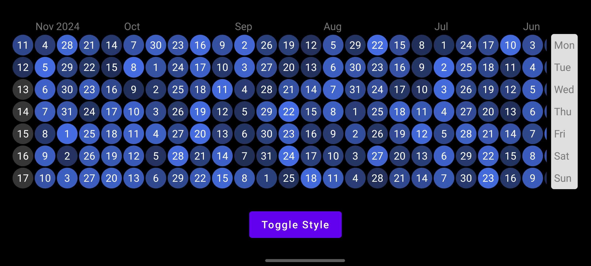

# Compose-HeatMap

[](https://central.sonatype.com/artifact/com.fleeys/heatmap) 

Effortlessly create GitHub-style heatmaps in Jetpack Compose—perfect for visualizing a variety of time-based data patterns.

## Preview

| Platform |                        Default Style                         |                         Custom Style                         |
| :------: | :----------------------------------------------------------: | :----------------------------------------------------------: |
| Android  |  |  |

## Usage

> build.gradle.kts

```kotlin
implementation("com.fleeys:heatmap:1.0.0")
```

> build.gradle

```groovy
implementation 'com.fleeys:heatmap:1.0.0'
```

## Overview

```kotlin
// ../library/src/commonMain/kotlin/com/fleeys/heatmap/HeatMap.kt

@Composable
fun <T> HeatMap(
  modifier: Modifier = Modifier,
  data: List<Heat<T>>,
  style: HeatMapStyle = HeatMapStyle(),
  onHeatClick: (Heat<T>) -> Unit
)
```

## Features


> [!IMPORTANT]  
> The project is in the experimental phase. All APIs can change incompatibly or be dropped without the deprecation cycle!

### Easy to use

Works right out of the box without much setup.

```kotlin
// ../sample/src/commonMain/com/fleeys/heatmap/sample/SampleHeatMap.kt

@Composable
fun SampleHeatMap() {
  Box(
    Modifier
      .fillMaxSize()
      .background(Color.Black)
      .padding(16.dp),
    contentAlignment = Alignment.Center
  ) {
    HeatMap(
      style = HeatMapStyle(),
      data = generateHeats()
    ) {
      println("Clicked: $it")
    }
  }
}

// fake data
private fun generateHeats(): List<Heat<Unit>> {
  val heats = mutableListOf<Heat<Unit>>()
  val startDate = LocalDate.of(2022, 11, 11)
  val curDate = LocalDate.now()

  var currentDate = startDate
  while (!currentDate.isAfter(curDate)) {
    val value = Random.nextDouble(0.00, 32.00)
    heats.add(Heat(currentDate, value))
    currentDate = currentDate.plusDays(1)
  }

  return heats
}
```

### Highly customizable

Almost everything you see can be manipulated.

```kotlin
// ../library/src/commonMain/kotlin/com/fleeys/heatmap/style/HeatMapStyle.kt

@Immutable
data class HeatMapStyle(
  val heatStyle: HeatStyle = HeatStyle(),
  val labelStyle: LabelStyle = LabelStyle(),
  val heatMapPadding: PaddingValues = PaddingValues(0.dp),
  val startFromEnd: Boolean = true
)
```

### Interactivity

Not just present, but interact.

use `onHeatClick(Heat<T>) -> Unit` to implement it.

### Generic data support

The operation is richer.

```kotlin
// ../library/src/commonMain/kotlin/com/fleeys/heatmap/HeatMap.kt

data class Heat<T>(
  val date: LocalDate,
  var value: Double,
  var data: T? = null
)
```

## Supportive

This project is built on Compose in an attempt to adapt to the Compose Multiplatform.

The currently adapted platforms are listed below:

| Platform |   State   |                            Sample                            |
| :------: | :-------: | :----------------------------------------------------------: |
| Android  |     ✅     | [Android-Sample](./sample/src/androidMain/kotlin/com/fleeys/heatmap/sample/MainActivity.kt) |
| Desktop  | :clock10: |                         coming soon                          |
|   ...    |           |                                                              |

## Contribution

Feel free to submit an issue if you have any feedback or suggestions!

The project is quite happy to receive your contributions, and it will be much more robust with your help!

I hope you like it, and if you think it's good, feel free to give a :star: !

## License

```
Copyright (c) 2024-present. Fleey

Licensed under the Apache License, Version 2.0 (the "License");
you may not use this file except in compliance with the License.
You may obtain a copy of the License at

   http://www.apache.org/licenses/LICENSE-2.0

Unless required by applicable law or agreed to in writing, software
distributed under the License is distributed on an "AS IS" BASIS,
WITHOUT WARRANTIES OR CONDITIONS OF ANY KIND, either express or implied.
See the License for the specific language governing permissions and
limitations under the License.
```